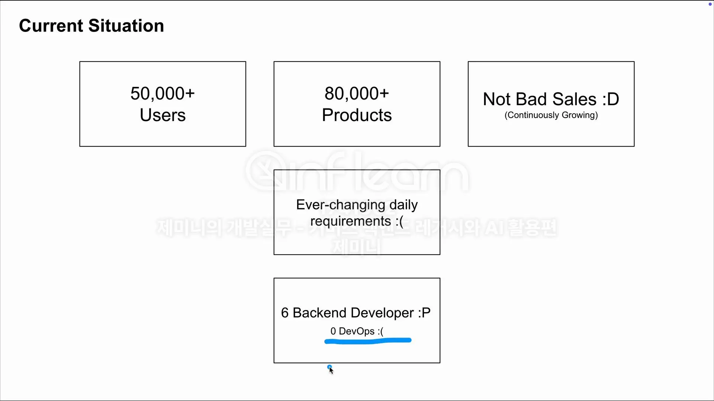
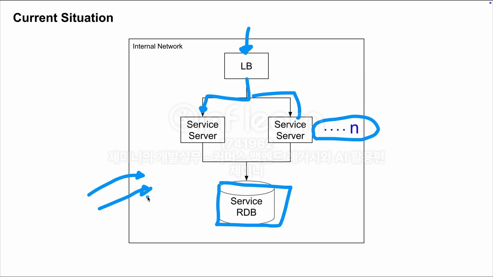
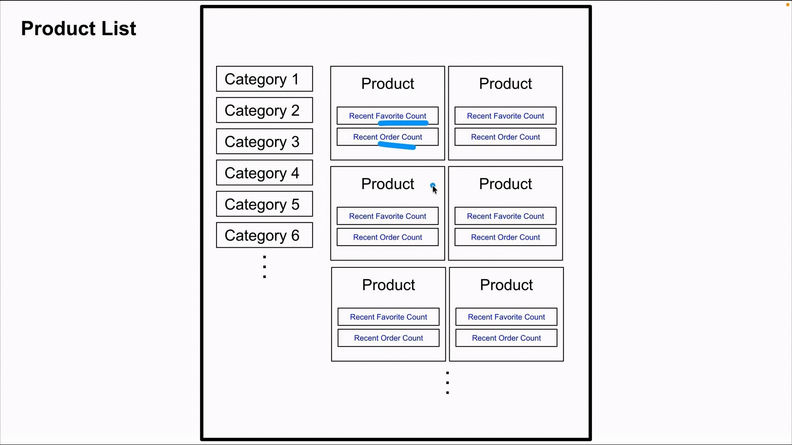

## AI

AI를 증명이 안됐다고 회사가 생각.

증명을 해보라고 한다고 생각.

intellij junie로 해결해보자.

ai agent를 다양하게 써도 유사한 부분 상당

레거시 개선 → 생산성의 향상

## 강의 구성

- 요구사항 느끼기
- 레거시 + AI 느끼기
- 코드 느끼기
    - AI가 작업한게 완전하지 않을 수 있다.
      코드를 최종 정리해본다.

→ 생각하는 힘을 길러야한다.

## 상황 정의





root 디렉토리 하위에 .junie 디렉토리 안에 [guidelines.md](http://guidelines.md) 를 매 프롬프트를 실행할 때 로드를 한다.

- 완벽하지 않은 guideline을 통해 레거시를 개선하고 기능을 개발하며 가이드라인을 업데이트 해보는 경험을 해보자.

```sql
//junie에게
guidelines.md 기준으로 코드 리팩토링해줘
```

→ 광역적 요청을 했다보니 작업을 잘 못하는 경향.

명령을 어떻게 하느냐에 따라 AI의 작업의 품질이 달라진다.

조금 더 명확한 프롬프트로 junie에게 명령해보자.

```sql
findProduct 함수의 Service 를 직접 쓰는 부분을 Assembler로 통합해줘
```

Junie에게 특정 파일을 읽으라고 지정해줄 수가 있다.

`우리가 정한 한가지 포인트를 지칭해서 일을 주면 더 준수한 결과를 가져와준다`

## 7. 상품 목록 - 요구사항 느끼기



위와 같은 기획서를 보고 내가 기획팀에게 뭘 질문해야 할까?

- 찜수와 구매 수는 정확도가 중요한편 인가요?
- 앞으로 다른 더 추가될 예정인 피쳐는 어떤것이 있나요?

…

물어볼 것

1. 어느 정도 기간의 찜수인지 등의 ‘기간’
2. 얼마나 실시간으로 갱신되어야 할 지 ‘갱신 주기’

- 새 상품일 경우 0, 0이 너무 많은데 괜찮을지 기획팀에 질문
  → 기획의도를 설명할거임.

## 8. 상품 목록 - 레거시 x AI 느끼기

```sql
상품 목록 조회 기능 findProducts 함수에 아래 요구사항을 구현해줘
- 최근 60일 동안의 찜하기 수를 추가해줘
- 찜하기는 Favorite 개념이야
- 최근 30일 동안의 주문 수를 추가해줘
- 주문은 Order 개념이야
- 상품과 찜하기, 주문은 연관된 개념은 아니야, 그러므로 Assembler를 통해서 조합하는 식으로 구현해줘
```

- PrdocutController.kt
- ProductService.kt
- ProductFinder.kt

```sql
작업1
ProductAssembler 에서는 Service 만을 사용해야해
favoriteFinder
orderFinder
두 개는 직접 사용 할 수없고, Service 로 격상 시켜야해

작업2
now 를 통해 날짜를 가져오는 부분은 정책적인 상수야 Enum 이나 Object로 적절히 추출해
```

> “AI가 나의 명령을 생각보다 이해를 잘하네?” 와 “AI가 생각보다 내 명령을 이해 못하네?”
이 두가지를 계속해서 번갈아 충분히 느껴야한다.
>

다양한 프롬프트 별로 어떤 결과가 나오고 어떤 부분이 아쉬운지 이 간극을 계속 느껴야하고 중요한 부분이다.

## 9. 상품 목록 - 코드 느끼기

- guideline 파일은 계속 쌓여서 자산이 될 것
- 토큰 제한때문에 미사용 코드 삭제는 중요한 영역
    - 인간, ai 크로스 체크 필요
- 나와 ai 뿐만 아니라 동료 개발자들이 코드를 봐야 하기 때문에 ‘의도’를 가진 위주의 수정을 많이 해야 한다.
    - ai가 작업한 결과물에 대해 나는 어떤 수정을 해야하지? 를 스스로 고민해야 한다.


# 내가 그래서 이 과정이 끝나고 작성하고 싶은 도전
- 처음에는 코덱스로 안드로이드 mvp를 뽑으려고 생각했음
- 코덱스의 코딩 결과 중심으로 내가 인지하거나 느끼는게 많이 없을 것 같다고 느낌.
  - 안드로이드에 대해 잘 모르기 때문에 ai를 느끼는데 방해된다고 판단.
- 작년부터 하고 있는 사이드 프로젝트에 junie를 통해 기존 코드를 레거시로 판단하고 개선하고 그 결과와 내가 사용하면서 배운 스킬들을 꼼꼼히 기록해 나가는 것으로 확정.