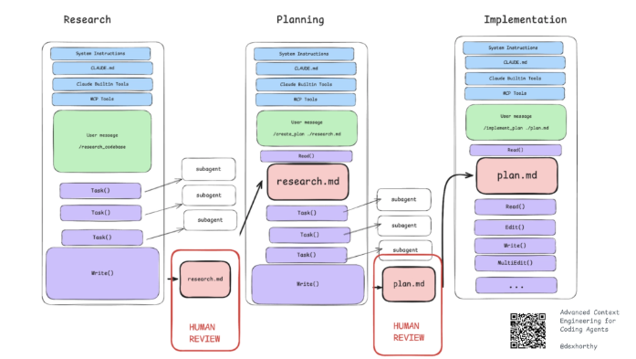
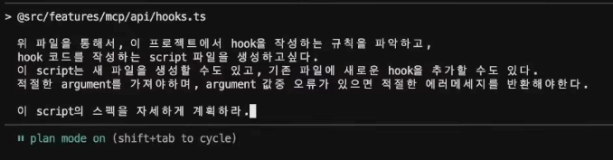

## 클로드 모델

| **기능** | **Claude Opus 4.6** | **Claude Sonnet 4.5** | **Claude Haiku 4.5** |
| --- | --- | --- | --- |
| **설명** | 에이전트 구축 및 코딩을 위한 가장 지능적인 모델 | 속도와 지능의 최적 조합 | 준최첨단 지능을 갖춘 가장 빠른 모델 |
| **가격** | $5 / 입력 MTok$25 / 출력 MTok | $3 / 입력 MTok$15 / 출력 MTok | $1 / 입력 MTok$5 / 출력 MTok |
| **확장 사고** | 예 | 예 | 예 |
| **적응형 사고**| 예 | 아니오 | 아니오 |
| **우선 티어** | 예 | 예 | 예 |
| **상대적 지연 시간** | 보통 | 빠름 | 가장 빠름 |
| **컨텍스트 윈도우** | 200K 토큰 /1M 토큰 (베타)3 | 200K 토큰 /1M 토큰 (베타)3 | 200K 토큰 |
| **최대 출력** | 128K 토큰 | 64K 토큰 | 64K 토큰 |

요약

|  | Opus | **Sonnet** | **Haiku** |
| --- | --- | --- | --- |
| 비용 | 상 | 중 | 하 |
| 성능 | 상 | 중 | 하 |
| 지연 시간(빠른 응답) | 중 | 상 | 최상 |
| 활용 | 코딩 | 간단한 설계 및 코딩 | 간단한 작업 및 리서치 |

## 컨텍스트를 잘 활용하는 방법

Anthropic을 잘 따라하면 됨

- plan mode 활용
    - 탐색 → 설계 → 구현으로 단계를 나누어 컨텍스트를 명확하게 구분하는 방법
    - step by step 방식을 mode로서 강제하는 방법
- mcp-cli, skill 활용
    - mcp-cli는 중간 데이터가 남지 않도록 하기 위해 사용
        - mcp를 그대로 호출하면 mcp를 호출하기 위한 데이터와 결과 데이터를 모두 컨텍스트에 올리기 때문에 비효율적
        - ex) 모든 학생들을 불어오는 mcp api가 있을 때 이 결과값 중 1등의 학생만 불러오는 요청에 대하여 모두 llm이 처리하지 않고 1등을 구분하는 로직은 코드로 직접 구현하게 해주는 것이 mcp-cli
    - skill → 모든 정보를 컨텍스트에 올리지 않고, 필요할 때만 올릴 수 있게 해줌
- mcp_ide_getDiagnostics
    - 보통 린트를 적용하기 위해 모든 파일(코드)에 대해 lint build 작업을 수행해야 하지만, mcp_ide_getDiagnostics는 ide에서 린트가 어긋난 부분(ide 상에서 빨간 줄로 제공해주는 부분)을 바로 가져올 수 있도록 해주기 때문에 lint를 수행할 필요 없게 해줌

## ⭐Plan mode

플랜 모드의 탐색 단계는 컨텍스트를 많이 필요로 하지만, 탐색 결과를 요약한 결과를 md 파일로 다음 단계에서 활용하기 때문에 컨텍스트를 효율적으로 관리하여 더 좋은 결과와 적은 토큰을 활용할 수 있게 해준다

설계(계획) 단계에서 이 방향성이 맞는지 체크하기 위해 부족한 정보를 개발자에게 물어본다.

만약, ‘이 서비스의 테스트가 잘 작성되었는지 점검해줘’ 라고 했을 때 점검해야 되는 범위를 파악하기 위해 ‘servcie는 잘 작성되어 있는데 repo, controller는 없다. 이 테스트도 추가할까요?’라고 물어본다.

또한 각 단계별로 컨텍스트가 분리되기 때문에 개발 단계에서 더 유리한 조건으로 시작할 수 있음

→ 복잡한 작업을 수행할 때는 안 쓸 이유가 없을 듯

→ 단순한 작업이라도 토큰 아끼려면 쓸 만한 듯

https://github.com/humanlayer/advanced-context-engineering-for-coding-agents/blob/main/ace-fca.md

## 꿀팁

내가 쓰는 프롬프트 질의를 따로 모아두기 ex) prompt/*.md

정확한 작업을 요구해야 하거나, 반복되는(규칙되는) 작업은 script를 만들어서 agent가 활용하게 한다

→ 스크립트에 파라미터가 누락되면 이를 보완해서 재실행하고, 반복되는 작업을 llm 대신 script를 사용하게 하면 컨텍스트를 아낄 수 있다.

→ script 짜는 게 어렵다면 이를 요청하면 된다

예시)

